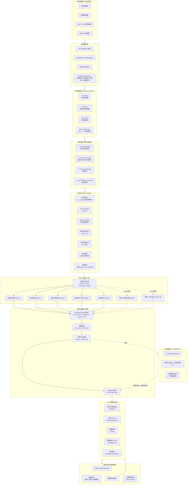

# 终端动态识别算法后端初步需求理解与设计方案不足分析报告

## 一、当前任务边界

目前我的工作重点不是实现完整“药品供应异常监测智能体”，而是先完成其中的“终端动态识别”算法后端设计。原始需求中包含价格异常、配送异常、终端动态、销量波动、分级处置与规则管理五类内容，但当前阶段我只负责终端动态相关部分，即围绕医疗机构对本企业产品的采购行为，识别以下两类核心线索：

1. 医疗机构长期未采购本企业产品，可能出现终端流失或终端流失风险；
2. 医疗机构首次采购本企业产品，形成新进终端识别。

因此，当前 v0 的目标不是直接建设完整 SaaS 产品，也不是建设完整工单流转系统，而是先建立一个可运行、可回测、可调试、可扩展的终端动态算法后端。

## 二、我对初步需求的理解

从业务数据看，系统主要依赖三类基础数据：药品主数据、医疗机构主数据和交易订单数据。药品主数据用于识别本企业产品、药品编码、规格、剂型、批准文号和产品线映射；医疗机构主数据用于识别医院、等级和地区；订单数据用于刻画医院对本企业产品的采购时间、采购数量、采购金额、配送与收货情况。

在终端动态识别场景下，最核心的分析单元应为：

```text
医疗机构 × 产品线
```

原因是，单个药品编码或单一规格粒度过细，容易受到临时断货、规格替换、包装变化等因素影响；而产品线粒度更接近业务人员理解的“某家医院是否还在采购我方某类产品”。同时，证据下钻仍应保留到：

```text
医疗机构 × 药品编码 / 规格 / 订单
```

这样既能保持风险判断稳定，又能让最终线索具备可追溯证据。

当前算法后端需要完成的基本任务包括：

1. 接入订单、药品、机构等原始数据；
2. 建立规范字段层，避免真实业务库表结构变化直接影响算法；
3. 将订单聚合到“医疗机构 × 产品线”的分析单元；
4. 基于历史采购行为建立个体基线；
5. 识别长期未采购、新进终端、采购节奏异常、采购频次下降、品规收窄等终端动态信号；
6. 输出结构化风险线索、触发原因、置信度和证据；
7. 提供调试接口，便于在没有真实数据或数据结构尚未明确时逐步验证算法逻辑；
8. 预留回测入口，用于后续基于历史真实流失样本评估提前量和误报率。

## 三、现有设计方案的合理部分

现有方案中有几部分思想值得保留。

第一，方案将“终端丢失检测”改为“终端流失风险巡检”，这是正确方向。终端已经完全停购后再提示，业务价值较低；如果能在采购节奏放缓、频次下降、品规收窄阶段提前提示，才有可能留出业务干预窗口。

第二，方案强调基线，而不是统一阈值。不同医院、不同产品线的采购周期差异很大。对高频采购品种和低频采购品种使用同一个“90 天未采购”阈值，容易导致误报。因此，每个分析单元都需要有自己的历史采购周期、采购频次和正常波动范围。

第三，需求形态分类有必要保留。对于平稳采购、波动采购、间断采购和块状采购，适用的检测方法不同。尤其是间断型和块状型采购，如果直接使用趋势检验，很容易把正常的低频补货误判为衰退。

第四，证据链思想是必要的。终端流失风险线索不能只给一个分数，必须说明“为什么报”“依据哪些订单事实”“与历史相比异常在哪里”。否则业务人员很难信任，也无法据此采取行动。

第五，算法与 Agent 的分工应当保留。风险打分、趋势判断、阈值判断、回测评估应由确定性算法完成。Agent 可以用于把结构化证据转成人类可读解释，但不应参与核心风险分计算。

## 四、现有设计方案的主要不足

### 4.1 当前方案边界过大，不适合 v0 直接实现

现有方案同时讨论了终端流失、价格、配送、销量、工单、驾驶舱、挽回价值、Agent 解释、组织路由等内容。它适合做远期产品蓝图，但不适合作为 v0 后端算法实现说明。

当前阶段更合理的范围是：

```text
只做终端动态识别算法后端：
长期未采购、新进终端、采购节奏异常、采购频次下降、品规收窄。
```

暂时不做：

```text
价格异常、配送异常、销量波动、完整工单处置、自动派单、完整多角色协作、复杂 Agent 协作。
```

### 4.2 原“七层流水线”更像展示结构，不适合作为后端执行拓扑

当前页面中把算法展示为：

```text
L0 → L0.5 → L1 → L2 → L3 → L4 → L4.5 → L5
```

这种线性拓扑便于前端展示，但不适合后端工程实现。真实算法后端中，很多模块并不是严格串行关系。

例如：

1. 数据质量检查、产品线映射、规范视图建设可以并行准备；
2. 需求形态分类之后，不同 detector 应并行执行；
3. 长期未采购、新进终端、频次下降、品规收窄本质上是并行探测器；
4. 回测、校准、配置评估不应该放在每日在线巡检链路中；
5. Agent 解释层不应阻塞核心风险线索生成。

因此，后端更适合设计为 DAG，而不是线性流水线。

### 4.3 L3 中“融合、交叉验证、FDR”概念混杂

融合是在线巡检的一部分；交叉验证是离线回测或模型评估的一部分；FDR 是否需要引入，也取决于 v0 是否真的使用大量统计显著性检验。

如果 v0 主要使用规则、采购间隔、频次下降、品规收窄等启发式 detector，那么暂时不需要把 FDR 作为强制模块。可以先保留“多 detector 命中数量”和“置信度”作为融合依据，等后续引入大量 p-value 检验后再加入 FDR 控制。

### 4.4 P(alive) / BG-NBD 不应作为 v0 的强依赖

BG/NBD 或 Pareto/NBD 适合做客户存活建模，但它对数据规模、购买行为假设和拟合稳定性有要求。在没有真实数据、没有明确产品线口径、没有回测标签之前，直接把 P(alive) 作为主干风险分，可能会让 v0 过重。

v0 更适合先实现可解释规则模型：

```text
风险信号 = 长期未采购 + 采购节奏超期 + 采购频次下降 + 品规收窄
```

后续在数据稳定、历史样本足够、回测可用后，再把 BG/NBD 作为 v1 或 v2 的主干概率模型接入。

### 4.5 同侪对照不应作为 v0 必做项

同侪对照依赖机构等级、地区、同类医院样本量和稳定的产品线口径。如果 v0 阶段没有真实数据，很难判断同侪组是否足够。若强行实现，可能会出现“同侪组样本过少”“同侪组不具可比性”“分组过粗或过细”等问题。

建议 v0 只预留同侪对照接口，不作为核心判断链路。后续真实数据接入后，再根据医院数量、地区分布、产品线覆盖情况决定是否启用。

### 4.6 Agent 不应被设计为每层一个

为每个 L 层设计一个 Agent 并不合适。L0、L0.5、L1、L2、L3 主要是确定性数据处理和统计计算任务，使用 Agent 会增加不可复现性和调试难度。

更合理的设计是：

```text
算法模块负责计算；
Agent 只负责解释；
解释结果不能反向修改风险分。
```

v0 可以仅预留 `explanation_service`，输入结构化证据，输出可读解释。核心算法链路不依赖 Agent。

### 4.7 当前缺少数据适配层设计

目前尚未拿到实际数据，且真实数据可能分散在多张表中。现有方案虽然提到标准字段 schema，但在 v0 实现上必须进一步明确：

1. 原始数据源可能是数据库、视图、CSV、Excel 或接口；
2. 算法不应直接读取业务库原表；
3. 应先建设 canonical schema；
4. 应提供 adapter interface；
5. 应支持后续通过数据库视图或物化视图提升性能；
6. 应提供数据质量检查，避免字段缺失、时间解析失败、订单重复、数量异常等问题直接进入算法。

这一层是当前 v0 最优先要补的工程设计。

## 五、建议的新拓扑结构

原先的线性拓扑应改为“数据适配层 + 规范视图层 + 特征层 + 并行 detector 层 + 融合层 + 线索层 + 离线回测层”的 DAG。新的拓扑结构如下：



## 六、新拓扑相对旧拓扑的改进点

### 6.1 从线性流水线改为 DAG

旧拓扑强调 L0 到 L5 的顺序执行，但真实后端中 detector 应该并行。新拓扑将“长期未采购、新进终端、采购节奏异常、采购频次下降、品规收窄”设计为并行 detector。这样更便于扩展，也更便于调试单个模块。

### 6.2 明确数据适配层

新拓扑把数据适配层放在最前面，承认真实数据结构暂时未知。算法只依赖 canonical schema，不直接依赖业务库原表。未来如果数据来自数据库视图、CSV、Excel 或 API，只需要替换 adapter，不需要重写算法模块。

### 6.3 明确规范视图层

考虑到真实数据可能分散在多张表中，且订单数据量可能较大，新拓扑加入了规范视图和物化视图层。这样既能提升性能，也能把复杂表连接逻辑从算法中剥离出来。

### 6.4 明确 as_of_date，防止时间穿越

终端动态识别必须支持回测。所有特征计算都应基于 as_of_date，只允许使用该日期之前的数据。否则线下回测会把未来订单混入历史特征，导致结果虚高。

### 6.5 将 Agent 降级为可选解释层

新拓扑中 Agent 不参与风险打分，只接收结构化证据并生成自然语言解释。这样既保留了未来智能化表达能力，也保证核心算法可复现、可审计。

### 6.6 将回测与在线巡检分离

旧设计容易把交叉验证、FDR、校准等内容混入在线流水线。新拓扑明确区分：

```text
在线链路：生成风险线索；
离线链路：评估阈值、回测效果、管理配置版本。
```

这样更符合真实工程实现。

## 七、v0 推荐实现范围

v0 不应追求一次性实现完整方案。建议优先实现以下内容：

1. canonical schema；
2. CSV / Mock 数据适配器；
3. 数据质量检查；
4. 医疗机构 × 产品线聚合；
5. as_of_date 时间窗切分；
6. 需求形态分类；
7. 长期未采购 detector；
8. 新进终端 detector；
9. 采购节奏异常 detector；
10. 采购频次下降 detector；
11. 品规收窄 detector；
12. 规则融合；
13. 结构化证据链；
14. 单单元调试接口；
15. 全量 dry-run 接口；
16. walk-forward 回测 skeleton。

暂缓实现：

1. BG/NBD 主干模型；
2. 复杂概率校准；
3. FDR 控制；
4. uplift 可挽回性模型；
5. 自动派单；
6. 多智能体协作；
7. 完整工单闭环；
8. 价格、配送、销量波动模块。

## 八、当前最需要补充确认的问题

在进入真实开发前，需要尽快确认以下数据问题：

1. 产品线如何定义：是否有现成产品线字段，还是需要由药品编码、通用名、规格映射？
2. 本企业产品如何识别：通过生产企业字段、批准文号，还是客户另有产品主数据？
3. 订单编号粒度：一行是否代表一个完整订单，还是存在分批配送、多行拆分？
4. 历史数据时间跨度：是否至少有 12 个月以上订单？
5. 医疗机构编码是否稳定：是否存在医院改名、合并、编码变化？
6. 采购数量和采购金额是否存在退货、冲销、负数记录？
7. 下单时间、配送时间、收货时间是否完整，是否存在延迟回填？
8. 是否能拿到已知真实流失终端样本，用于后续回测验证？

## 九、阶段性结论

目前方案的核心方向是正确的：从“终端已经丢失后提醒”转向“终端出现流失风险时提前预警”，并通过历史基线、需求形态分类、并行 detector、证据链和回测机制提升可靠性。

但原方案更像远期产品蓝图和前端 demo 展示结构，不适合直接作为 v0 后端算法实现方案。当前应将任务收缩为“终端动态算法后端 v0”，重点建设数据适配层、规范视图层、可调试 detector、结构化证据和回测接口。旧的七层线性流水线应调整为更适合工程实现的 DAG 拓扑，以便后续逐步扩展 BG/NBD、同侪对照、概率校准和 Agent 解释能力。
