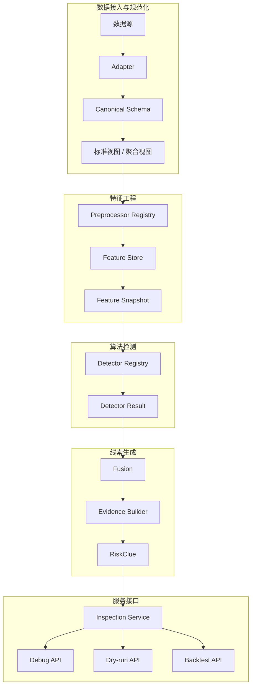

```mermaid
flowchart TB
    subgraph S1["数据接入与规范化"]
        A["数据源"]
        B["Adapter"]
        C["Canonical Schema"]
        D["标准视图 / 聚合视图"]
    end

    subgraph S2["特征工程"]
        E["Preprocessor Registry"]
        F["Feature Store"]
        G["Feature Snapshot"]
    end

    subgraph S3["算法检测"]
        H["Detector Registry"]
        I["Detector Result"]
    end

    subgraph S4["线索生成"]
        J["Fusion"]
        K["Evidence Builder"]
        L["RiskClue"]
    end

    subgraph S5["服务接口"]
        M["Inspection Service"]
        N["Debug API"]
        O["Dry-run API"]
        P["Backtest API"]
    end

    A --> B --> C --> D
    D --> E --> F --> G
    G --> H --> I
    I --> J --> K --> L
    L --> M
    M --> N
    M --> O
    M --> P

```
